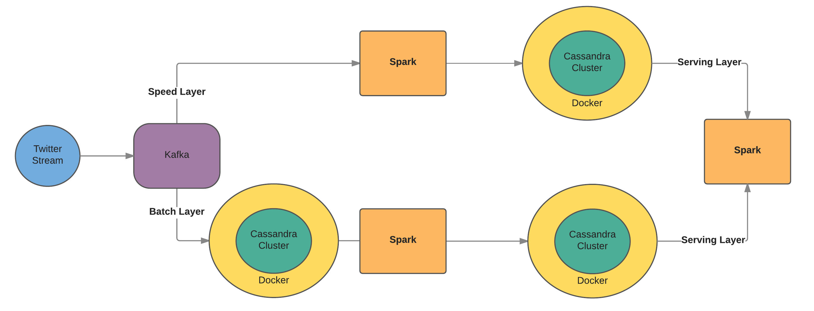

# trendOff

This repo contains the code used for my final in my Data Engineering Course at Galvanize University.  The project relies on code from Scala, Spark, a bit of CQL(executed by spark), and some Python(solely for plotting) and relies on the big data technologies of Kafka, Cassandra and Docker.  

The goal of my project was to use different big data technologies to implement a lambda architecture where someone could compare the Twitter word usage of one user verses another.

My project implements a lambda architecture.  A stream of tweets are pumped into Kafka where a Kafka Producer sends out the tweets.  I have two consumer groups, one for the speed layer of my lambda architecture and another for the batch layer of my lambda architecture.  The speed layer ingest the kafka stream via spark where I combine all the tweets from a given user and then save them to a table in my Cassandra cluster which is on Docker(usually there are not multiple tweets to combine for a user since people do not usually send two tweets within a minute of eachother).  The batch layer also ingests the Kafka stream using Spark, but saves the tweet and most of its meta data(8 features in total) to a table in my Cassandra cluster on Docker.  The data in this table accumulates and waits for a batch process to be performed on it.  I perform a batch process on this data via Spark where I grab all the data stored in this table, group all the tweets for each user, and then save the data to a new table in my Cassandra cluster.  I finally have a serving layer that uses some Spark, Scala and functional programming to grab the relevant data for the two users from both the speed and batch tables to grab the most frequently, mutually used words between the two users and the counts for how often each user used the given word.  I store these three arrays in a text file where then some python code grabs the data and produces a grouped bar chart for the two users word counts.

Also I was able to run this data pipeline on both my local machine and an EC2 instance.  The majority of the execution of this code was done on EC2.

## Data_Enginnering_Final_Project.ipynb:
Please look to this iPython Notebook for a more detailed description of the project and each Scala package

##scala-kafka-twitter:
I used the code from a repo produced by [Marcel Krcah](http://marcelkrcah.net) on his Github, which can be found [here.](https://github.com/mkrcah/scala-kafka-twitter)  The code uses Scala to to take a twitter stream, encode the tweets in an Avro schema and then sends them as a Kafka message via a Kafka producer.  Marcel's code only used the username and tweet, but since I wanted to get more meta data I had to alter his code so I could grab this extra data about each tweet.  I also took the liberty of commenting his code, to check my own understanding.  Marcel's code provides an easy and efficient way to send tweets through a Kafka producer. 

## csv:
Contains the Scala package, that uses Spark, that takes Twitter data from a CSV file into a Cassandra table that the batch process will be performed on.  I got the data from the csv [here](http://followthehashtag.com/content/uploads/USA-Geolocated-tweets-free-dataset-Followthehashtag.zip).

##speedk:
Contains the Scala package, that uses Spark, that performs the speed layer of my lambda architecture.

##streamk:
Contains the Scala package, that uses Spark, that ingests the data from the Kafka stream into a Cassandra table that the batch process will be performed on.

## batch:
Contains the Scala package, that uses Spark, that implements the batch layer of the lambda architecture.

##serving:
Contains the Scala package, that uses Spark, that implements the serving layer of my lambda architecture.

